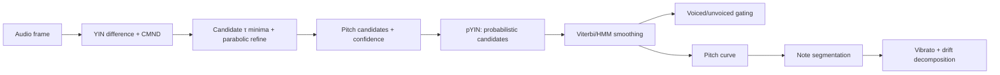
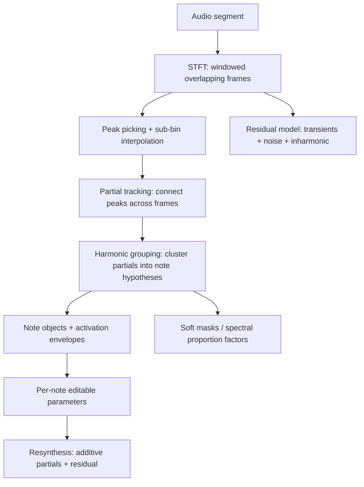
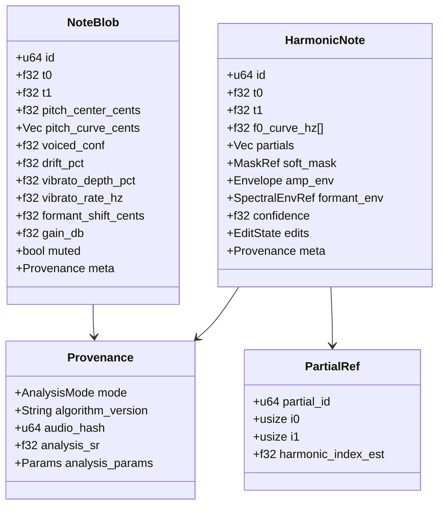

# Knead — Pitch Correction and Melodic Editing for Sourdaw

## Executive Summary

Knead must ship as **two tightly integrated systems** with a shared note-object model:

- A **real-time monophonic corrector** (tracking/live UX): fast pitch tracking + low-latency pitch shifting + musical retuning controls (speed, tolerance, humanize, vibrato behavior, MIDI/scale constraints).
- An **offline analysis + edit + resynthesis engine** (editor UX): converts audio into **editable note objects** (“blobs”) with pitch/time/formant/level handles and reconstructs audio after per-note edits.
- A **polyphonic “DNA-level” decomposition mode** (the hardest part): extracts **note objects inside chords** using STFT/sinusoidal modeling, peak/partial tracking, harmonic grouping, and **soft time–frequency attribution masks** (“spectral proportion factors”) to support per-note editing without turning the problem into full stem separation. The relevant patent language explicitly frames the goal as discriminating pitches/pitch evolutions (note objects) rather than separating real-world sources, and states the method is primarily for already-recorded material (not live real-time). citeturn6view4turn6view5

A feasible product strategy is:

- **Ship world-class monophonic correction first** (Knead is immediately useful for vocals and single-note instruments).
- Add **offline monophonic blob editor** (Flex Pitch/Melodyne-style editing surface).
- Add **polyphonic analysis + note-assignment repair tooling** as a “Lab mode,” with strong confidence overlays and fallback behaviors on dense/ambiguous material—matching how advanced editors explicitly require fine-tuning/repair in polyphonic detection workflows. citeturn14search6turn14search7turn14search3

## Product Requirements and Competitive Behaviors

### What “DNA-level polyphonic editing” requires

A polyphonic note editor must do more than “detect multiple pitches.” It must:

- Identify **note objects** (pitch trajectories that can include vibrato/portamento) and expose them to the user.
- Attribute some portion of the signal to each note object so that per-note edits can be resynthesized.
- Provide **manual repair tools** (split/merge, re-assignment) because plausible interpretations multiply rapidly in polyphonic material, and distorted/complex audio leads to ambiguous detection. citeturn14search6turn14search12
- Run primarily as **offline/background analysis** because a stable note-object interpretation depends on context; the referenced patent also explicitly describes analysis over a past interval of several seconds and emphasizes the method is not intended as true “real time” performance processing. citeturn6view4turn6view5

### Competitive control semantics Knead must match

The most “must-match” behaviors are stable across leading tools:

- **Retune speed** (ms): 0 ms = instantaneous snapping and vibrato suppression; 10–50 ms typical for natural correction; larger values preserve expressive gestures but correct more slowly. citeturn9view3
- **Tolerance / hysteresis**: avoid unwanted note transitions by requiring enough pitch deviation (cents threshold) and/or persistence time before switching target notes. citeturn9view4
- **Humanize / vibrato-aware targeting**: treat sustained-note modulation differently than note transitions so vibrato and intended pitch nuance are not flattened. citeturn9view3
- **Formant preservation vs. formant shifting**: “preserve” for realism; “shift” for creative timbre changes; the best tools describe these as distinct controls and note that natural singing often shifts formants slightly upward on higher notes. citeturn4search2turn4search17
- **Polyphonic editor UX**: stacked blobs in chords, plus a note assignment mode where tools adjust detection/interpretation rather than directly changing sound. citeturn0search4turn14search7

### Patent and IP risk posture

The note-object polyphonic processing approach described in a widely cited patent includes: overlapping windows, Fourier transform, per-bin energy, event objects, note objects, associating events to notes, and computing “spectral proportion factors” for note objects; the Google Patents listing indicates an active status and shows an expiration in 2029. Treat this as an **engineering constraint**: you should involve counsel early, avoid cloning claim language/mechanics, and maintain multiple fallback paths (time-slice “universal” processing and whole-chord operations) if polyphonic note access is restricted by feasibility or IP constraints. citeturn6view5turn6view4

## Monophonic Engine and Real‑Time Pitch Correction

### Monophonic analysis pipeline overview

Monophonic pitch correction needs four outputs:

1. **Frame-level f0 estimate** (or “unvoiced”)
2. **Confidence / periodicity metric**
3. **Smoothed pitch curve** (continuous f0 trajectory)
4. **Discrete note objects** (for blob view and per-note controls)

A robust production pipeline:



### YIN — algorithm, parameters, and failure modes

**Core idea.** YIN transforms pitch tracking into finding a lag τ with strong periodic similarity, using a **difference function** and a normalization that reduces octave/doubling bias.

**Algorithm sketch (per frame):**

- Compute difference function:

\[
d(\tau)=\sum\_{t=0}^{N-\tau-1}\left(x[t]-x[t+\tau]\right)^2
\]

- Compute cumulative mean normalized difference (CMND):

\[
d'(\tau)=\frac{d(\tau)}{ \frac{1}{\tau}\sum\_{j=1}^{\tau} d(j) }
\]

- Find the **first local minimum** below a threshold (e.g., 0.1–0.2), then refine τ with parabolic interpolation around the minimum.
- Convert to frequency: \( f_0 = \frac{f_s}{\tau} \).

This “CMND + first-minimum threshold” structure is the signature of YIN and is explicitly cited as the key differentiator in literature and implementations. citeturn12search0turn12search7

**Recommended real-time parameter defaults (44.1/48 kHz):**

| Use                          | Frame size |      Hop |  Overlap |   f0 range | Notes                                            |
| ---------------------------- | ---------: | -------: | -------: | ---------: | ------------------------------------------------ |
| Low-latency tracking vocals  |       2048 |  256–512 | 75–87.5% | 80–1000 Hz | Good responsiveness; slightly less stable low f0 |
| Higher-stability vocals/bass |       4096 | 512–1024 | 75–87.5% |  50–600 Hz | Better for low notes; more latency               |

Practical guidance: start at **2048/256** (≈46 ms window, ≈6 ms hop at 44.1 kHz) for smooth tracking, then expose a “latency/accuracy” selector.

**Rust-like pseudocode (YIN core):**

```rust
struct YinConfig {
    sample_rate: f32,
    frame_size: usize,
    f0_min: f32,
    f0_max: f32,
    cmnd_threshold: f32, // e.g., 0.15
}

struct YinResult {
    f0_hz: Option<f32>,
    periodicity: f32, // 0..1 (1 = strongly periodic)
    tau: Option<f32>, // sub-sample
}

fn yin_frame(x: &[f32], cfg: &YinConfig) -> YinResult {
    let n = cfg.frame_size;
    let tau_min = (cfg.sample_rate / cfg.f0_max).floor() as usize;
    let tau_max = (cfg.sample_rate / cfg.f0_min).ceil() as usize;

    // 1) difference function
    let mut d = vec![0.0_f32; tau_max + 1];
    for tau in 1..=tau_max {
        let mut sum = 0.0;
        for t in 0..(n - tau) {
            let diff = x[t] - x[t + tau];
            sum += diff * diff;
        }
        d[tau] = sum;
    }

    // 2) CMND
    let mut cmnd = vec![1.0_f32; tau_max + 1];
    let mut running = 0.0_f32;
    for tau in 1..=tau_max {
        running += d[tau];
        cmnd[tau] = if running > 0.0 { d[tau] * (tau as f32) / running } else { 1.0 };
    }

    // 3) pick first dip under threshold
    let mut pick: Option<usize> = None;
    for tau in tau_min..=tau_max {
        if cmnd[tau] < cfg.cmnd_threshold {
            // local min search
            let mut t0 = tau;
            while t0 + 1 <= tau_max && cmnd[t0 + 1] < cmnd[t0] {
                t0 += 1;
            }
            pick = Some(t0);
            break;
        }
    }

    // 4) parabolic refinement
    if let Some(tau_i) = pick {
        let tau_f = parabolic_minimum(&cmnd, tau_i); // returns float τ
        let f0 = cfg.sample_rate / tau_f;
        let periodicity = 1.0 - cmnd[tau_i].clamp(0.0, 1.0);
        YinResult { f0_hz: Some(f0), periodicity, tau: Some(tau_f) }
    } else {
        YinResult { f0_hz: None, periodicity: 0.0, tau: None }
    }
}
```

**Common YIN failure modes:**

- **Subharmonic / octave errors**: can occur when the signal has strong even/odd harmonic ambiguity or when the threshold is poorly tuned.
- **Breathy/noisy vowels**: periodicity metric falls; false unvoiced or unstable f0.
- **Rapid transitions** (consonants, glottal fry, growl): pitch tracking becomes discontinuous; needs voicing gating and smoothing.

### pYIN — probabilistic candidates + sequence decoding

pYIN is best understood as:

- Run a YIN-like analysis, but instead of a single τ threshold, produce **multiple pitch candidates** with **probabilities** (via a distribution over thresholds).
- Use a **sequence model (HMM) decoded with Viterbi** to pick a globally consistent pitch track while jointly estimating voicing. citeturn0search10turn17search7

This design directly targets YIN failure modes:

- It reduces octave flips by penalizing implausible jumps.
- It smooths vibrato without flattening it, by allowing small continuous transitions.
- It lets voicing be an inferred state rather than a hard local threshold.

**Pragmatic pYIN defaults:**

- Frequency bins: 10–20 cents resolution internally (finer bins improve stability but increase computation).
- Transition costs:
    - small cost per semitone step (favor continuity),
    - large cost for octave jumps,
    - explicit voiced↔unvoiced transition penalties (avoid chatter).
- Candidate pruning: keep top K τ minima per frame (e.g., K=3–5).

### Voiced/unvoiced detection (V/UV)

Knead should compute a **voicing probability** per frame, used to:

- bypass correction on unvoiced regions (breaths, fricatives),
- avoid PSOLA pitch marking where it will fail,
- support “sibilant handling” and noise preservation behaviors similar to advanced editors.

A robust V/UV classifier can blend:

- periodicity/confidence (from YIN/pYIN),
- spectral flatness (noise-like vs harmonic),
- harmonic-to-noise-like ratio heuristics.

Neural pitch estimators like SPICE explicitly incorporate a confidence head that can be used for voicing detection rather than handcrafted thresholds, demonstrating that “confidence as voicing proxy” is viable. citeturn8view2

### Note segmentation rules (monophonic blobs)

A note (“blob”) is a **stable musical region** with:

- a pitch center,
- internal drift + vibrato,
- boundaries where pitch, energy, or voicing suggests a new note.

**Segmentation criteria (combined):**

1. **Voicing boundaries**
    - if V/UV flips to unvoiced for > ~30–60 ms, cut a note boundary.

2. **Onset/energy cues**
    - spectral flux peak or energy rise marks likely onset.
    - if onset occurs while voicing remains, cut only if pitch center changes substantially soon after.

3. **Pitch discontinuity**
    - if \(|\Delta f_0|\) exceeds ~80–120 cents within a short window (e.g., 30–80 ms), start a new note.

4. **Micro-gesture protection**
    - do **not** segment inside vibrato or small pitch gestures unless consistent with onset cues.

**Recommended defaults (monophonic):**

- minimum note length: 60–80 ms
- minimum voiced duration to form a note: 40–60 ms
- pitch change threshold for segmentation: 100 cents (with hysteresis)
- unvoiced gap threshold: 40 ms (to ignore tiny consonant gaps)

### Vibrato modeling and control

Vibrato is periodic modulation of f0. Typical vocal vibrato is often reported around **5–7 Hz** with extent varying by style/training; one study describes 5–7 Hz and extent on the order of several percent of f0 (roughly comparable to about ±1 semitone in some contexts). citeturn5search8turn5search0

**Knead representation (per note):**

- base pitch curve \(b(t)\): low-frequency trend (intonation + portamento)
- modulation \(m(t)\): band-limited component around ~3–9 Hz
- remainder \(r(t)\): jitter/noise

Implementation:

- compute pitch curve in cents relative to note center
- apply a band-pass filter (e.g., 3–9 Hz) to isolate vibrato component
- estimate rate via autocorrelation or FFT peak on \(m(t)\)
- estimate depth as RMS or peak-to-peak in cents (typical UI: 0–100%)

Controls:

- **Vibrato Preserve**: leave \(m(t)\) untouched while tuning \(b(t)\)
- **Vibrato Reduce**: scale \(m(t)\) by factor 0..1
- **Vibrato Add**: inject synthetic sinusoidal FM with controllable rate, depth, delay-in, and jitter

### Real-time pitch correction behavior (speed, tolerance, humanize, MIDI)

Use an explicit control model tied to audible results:

#### Scale/key mapping

- Represent notes as **pitch classes** (0–11) plus octave.
- Allowed set A is derived from key+scale (or a user-custom scale).
- Target note is chosen by minimizing distance in cents, with hysteresis.

#### Tolerance (dead zone + hold time)

Borrow the semantics of “cents tolerance + time tolerance”:

- If within ±T cents of the current target, keep target.
- Switch target only if pitch stays outside tolerance for at least T_time, to avoid micro-wiggles causing note hopping. citeturn9view4

#### Retune speed (first-order smoother with separate attack/sustain)

A practical model:

- detect note onset (from segmentation cues or transient/flux)
- use faster correction constant during onset region (0–80 ms)
- use slower correction during sustain (Humanize)

Auto‑Tune’s manual describes retune speed in **milliseconds**, explicitly noting 0 ms yields immediate changes and suppresses vibrato/deviations; 10–50 ms is typical for natural correction. citeturn9view3

#### MIDI input mode

- If MIDI notes are held, target set becomes exactly those notes (or last note, or chord-based selection).
- When no MIDI notes held, fall back to scale mapping.

Auto‑Tune’s documentation includes MIDI-based scale definition (“learn scale”) behaviors; Knead should match the “MIDI defines legal notes” pattern. citeturn3search18turn9view3

## Polyphonic Analysis and Note‑Object Decomposition

### Why sinusoidal modeling is the most edit-friendly representation

For polyphonic editing, you need a representation that supports:

- independent manipulation of note pitch trajectories,
- phase-coherent resynthesis,
- soft overlap handling.

Classic sinusoidal analysis/synthesis explicitly models a frame as a set of sinusoidal components with amplitude, frequency, and phase estimated from the STFT, then addresses the hard part: **frame-to-frame peak matching** because peaks appear/disappear and move due to changing pitch and sidelobe interactions. citeturn10view1

### Polyphonic pipeline overview (DNA-style, but implementable)



The patent language for note-object oriented polyphonic processing describes: overlapping windows, Fourier transform, per-bin energy, event objects, note objects, associating events and notes by plausible timing, and computing spectral proportion factors for each note object. citeturn6view5turn6view4

### STFT configuration and window choices

**Defaults (polyphonic analysis):**

- window: **Blackman–Harris** for better sidelobe suppression (reduces false peaks near strong harmonics), or Hann when CPU is tight.
- size: **8192** (44.1 kHz → ~186 ms window; high frequency resolution)
- hop: **2048** (25% hop) for stable tracking; consider 1024 for smoother trajectories.
- use zero-padding for finer peak interpolation (optional).

Trade-off:

- Larger windows improve harmonic discrimination (critical for chord tones close in frequency).
- Smaller hops improve temporal continuity for partial tracking and reduce “staircase” in f0 tracks.

image_group{"layout":"carousel","aspect_ratio":"16:9","query":["STFT spectrogram harmonic series vocal","spectral peak picking diagram audio","sinusoidal partial tracking illustration","harmonic grouping fundamentals diagram"],"num_per_query":1}

### Peak picking and sub-bin interpolation

Per frame:

1. Compute magnitude spectrum \(|X[k]|\).
2. Find **local maxima** above adaptive threshold:
    - threshold = max(noise_floor + margin, percentile-based)
3. For each peak at bin k, do **quadratic interpolation** in log-magnitude:
    - estimate fractional bin offset δ
    - refined frequency \( f = (k + \delta)\frac{f_s}{N} \)
4. Store:
    - frequency, amplitude, phase
    - optional peak “prominence” feature for later filtering

This peak-based approach matches the “peak-detection stage followed by peak-shifting stage” in advanced phase-vocoder work, where peak structure is treated as a core primitive for clean modifications. citeturn6view2turn0search3

### Partial tracking (peak matching, birth/death, slope constraints)

Partial tracking converts per-frame peaks into **sinusoid trajectories**:

- Each partial p has a state:
    - last frequency \(f*{t-1}\), amplitude \(a*{t-1}\), phase \(\phi\_{t-1}\)
    - estimated slope \( \Delta f \) (optional)
    - age, stability score

**Matching rule (between frames t and t+1):**

- Candidate peaks within frequency neighborhood:
    - \(|f*{cand} - f*{pred}| < f\_{gate}\)
- Cost function:
    - \(w*f |f*{cand}-f*{pred}|\) + \(w_a |a*{cand}-a\_{pred}|\) + \(w_s\) (stability penalty)
- Choose assignment via:
    - greedy sorted by strongest peaks (fast)
    - Hungarian assignment (better but heavier)

**Birth/death:**

- Birth: unmatched peaks above threshold start new tracks.
- Death: tracks that fail to match for M frames (e.g., 2–4) end, possibly with a fade-out.

**Slope constraint:**

- For voiced harmonic partials, instantaneous frequency should change slowly relative to hop:
    - enforce max cents-per-second slope
    - allow faster slope near transients or detected note transitions

Sinusoidal modeling literature emphasizes that peak matching is hard in practice because peaks can appear/disappear due to sidelobe interactions and pitch changes, motivating robust tracking and interpolation of amplitude/phase trajectories. citeturn10view1

**Rust-like pseudocode (partial tracker skeleton):**

```rust
struct Peak { f_hz: f32, mag: f32, phase: f32 }
struct Partial {
    id: u64,
    points: Vec<(f32 /*t*/, f32 /*f*/, f32 /*mag*/, f32 /*phase*/)>,

    // state
    f_pred: f32,
    mag_pred: f32,
    missed: u32,
    alive: bool,
}

struct TrackerConfig {
    f_gate_hz: f32,     // e.g., 20–80 Hz depending on band
    max_missed: u32,    // e.g., 3
    w_f: f32, w_mag: f32,
}

fn track_frame(partials: &mut Vec<Partial>, peaks: &[Peak], t: f32, cfg: &TrackerConfig) {
    let mut used = vec![false; peaks.len()];

    // 1) try to match existing partials
    for p in partials.iter_mut().filter(|p| p.alive) {
        let mut best: Option<(usize, f32)> = None;

        for (i, pk) in peaks.iter().enumerate() {
            if used[i] { continue; }
            let df = (pk.f_hz - p.f_pred).abs();
            if df > cfg.f_gate_hz { continue; }

            let cost = cfg.w_f * df + cfg.w_mag * (pk.mag - p.mag_pred).abs();
            if best.map(|(_, c)| cost < c).unwrap_or(true) {
                best = Some((i, cost));
            }
        }

        if let Some((i, _)) = best {
            let pk = &peaks[i];
            used[i] = true;
            p.points.push((t, pk.f_hz, pk.mag, pk.phase));
            p.f_pred = pk.f_hz;    // + optional slope model
            p.mag_pred = pk.mag;
            p.missed = 0;
        } else {
            p.missed += 1;
            if p.missed > cfg.max_missed {
                p.alive = false;
            }
        }
    }

    // 2) births
    for (i, pk) in peaks.iter().enumerate() {
        if used[i] { continue; }
        // threshold peaks upstream before here
        partials.push(Partial {
            id: new_id(),
            points: vec![(t, pk.f_hz, pk.mag, pk.phase)],
            f_pred: pk.f_hz,
            mag_pred: pk.mag,
            missed: 0,
            alive: true,
        });
    }
}
```

### Harmonic grouping into note objects

Once partials exist, group them into **harmonic sets** that represent a note.

#### Candidate f0 generation

For each frame or short span:

- Use **subharmonic summation**:
    - for candidate f0 values, sum energy at multiples \(k f_0\), with weights decreasing with k.
- Or infer f0 from partials using a GCD-like approach in log frequency:
    - find f0 that minimizes deviation of partial frequencies from integer multiples.

#### Group scoring function

Define a score for a candidate note with fundamental f0:

- For each tracked partial i with frequency \(f_i\), compute nearest harmonic number:
    - \(k_i = \text{round}(f_i / f_0)\)
- Harmonic deviation penalty:
    - \( \epsilon_i = |f_i - k_i f_0| \) (in cents or Hz)
- Score:
    - energy term: sum magnitudes of aligned partials
    - penalty for missing low-order harmonics
    - penalty for high inharmonicity / inconsistent envelopes

A practical score:

\[
S(f*0) = \sum*{i \in P}\left( w_k \cdot a_i \cdot \exp(-\alpha \epsilon_i^2)\right) - \lambda \cdot \text{missing}(f_0)
\]

where \(w_k\) down-weights high harmonics.

#### Temporal consolidation (note segmentation in polyphony)

Notes must be stable over time, so you merge frame-level groupings into note objects by:

- requiring minimum duration (e.g., 60–120 ms)
- enforcing continuity of f0 (allow vibrato/portamento)
- allowing crossings: the patent explicitly states that pitch evolutions may vary arbitrarily and crossing notes can still be identified as distinct notes if evolutions are consistent. citeturn6view4

### Soft masks / spectral proportion factors

Polyphonic editing fails if you hard-assign each time–frequency bin to exactly one note. Instead use **soft attribution**:

- Build a modeled spectrum per note object \(N_j(t,f)\) from its partials (and optionally an estimated envelope).
- Compute total modeled spectrum \(M(t,f) = \sum_j N_j(t,f)\).
- Define per-note soft mask:
  \[
  W_j(t,f)=\frac{N_j(t,f)}{M(t,f)+\epsilon}
  \]
- Extract per-note contribution:
  \[
  X_j(t,f)=W_j(t,f)\cdot X(t,f)
  \]
  These “spectral proportion factors” are conceptually aligned with what the patent describes: associating part of the total sound to each note object for later manipulation and resynthesis. citeturn6view5turn6view4

**Residual definition:**

- residual STFT:
  \[
  R(t,f)=X(t,f)-\sum_j X_j(t,f)
  \]
- Or (more robust): keep residual as whatever is not explained by stable partial tracks (transients/noise/inharmonic).

### Residual modeling and transient awareness

For musical realism:

- Preserve attack transients and noise-like components.
- Do not phase-vocoder smear them.

Phase-vocoder transient preservation research emphasizes that naïve phase vocoder processing creates artifacts at attack transients and motivates transient detection criteria local in frequency so stationary parts are not affected, avoiding simplistic “force time-stretch factor to 1 during transients” hacks. citeturn11search4turn11search3

In Knead’s polyphonic engine:

- mark transient frames using spectral flux / energy slope and/or a peak-classification strategy
- route transient energy into residual or handle with time-domain methods
- ensure crossfades when recombining partial-synth and residual

### Hybrid designs with neural multipitch priors

Neural AMT/multipitch models are valuable not as the entire editing engine, but as **proposal generators** that reduce combinatorial ambiguity.

A lightweight multipitch/note model (Basic Pitch / NMP) demonstrates practical characteristics relevant to Knead:

- input representation: constant-Q transform (CQT), 3 bins per semitone
- hop size: ~11 ms
- harmonic stacking: shift CQT to align harmonics (7 harmonics + 1 subharmonic)
- outputs: onset, note activity, multipitch posteriorgrams
- tiny parameter count (~16,782 parameters), explicitly designed for low memory and runtime constraints citeturn15view2turn15view1

**Hybrid approach recommended:**

- Use NN posteriorgrams to propose:
    - which pitches are active
    - where onsets are
    - confidence regions
- Then run sinusoidal tracking constrained to those proposals:
    - narrower f0 candidate set
    - more stable grouping
    - user-facing confidence overlays grounded in model probabilities

**ONNX feasibility:**

- ONNX Runtime provides a cross-platform inference engine with performance tuning guidance; in Rust you can use a dedicated crate (“ort”) to run ONNX models in the desktop backend while keeping the audio thread safe. citeturn5search9turn5search13

## Resynthesis, Editing Operations, and Artifact Control

### Pitch shifting engines: PSOLA and phase vocoder

Knead needs both:

- **PSOLA** for monophonic, low-latency, natural small-to-moderate shifts.
- **Phase vocoder** (peak/phase-locked) for larger shifts, harmonizer voices, and polyphonic components.

#### PSOLA implementation (monophonic)

PSOLA modifies pitch by:

- segmenting audio into pitch-synchronous grains (aligned to epochs/pitch marks),
- overlapping and adding grains at a new spacing to achieve a new period.

PSOLA literature describes both time-domain and frequency-domain variants and emphasizes that prosody modification is achieved via pitch-synchronous overlap-add, with time-domain approaches being direct and efficient when pitch marks are accurate. citeturn13search0turn13search4

**Key engineering requirements:**

- robust pitch mark detection
- stable behavior near voiced/unvoiced transitions
- crossfades to avoid clicks

**Recommended PSOLA defaults:**

- grain length: 2 pitch periods (common robust choice)
- window: Hann
- overlap: typically 50% in the grain domain
- max shift for “transparent” quality: ~±4 semitones (beyond that, expect artifacts and consider vocoder)

**Rust-like pseudocode (PSOLA grain loop):**

```rust
struct PsolaConfig {
    sample_rate: f32,
    max_semitones_transparent: f32,
}

fn psola_process(
    input: &[f32],
    pitch_marks: &[usize], // indices of epochs
    target_f0_curve: &[f32],
    cfg: &PsolaConfig
) -> Vec<f32> {
    let mut out = vec![0.0_f32; input.len()];

    for n in 1..pitch_marks.len()-1 {
        let pm = pitch_marks[n];
        let p_prev = pitch_marks[n-1];
        let p_next = pitch_marks[n+1];
        let period = (p_next - p_prev) as f32 * 0.5;

        // grain: centered at pm, length ~2 periods
        let half = period.round() as isize;
        let start = (pm as isize - half).max(0) as usize;
        let end   = (pm as isize + half).min(input.len() as isize - 1) as usize;

        let grain = &input[start..end];
        let window = hann_window(grain.len());

        // compute destination center based on desired period from target_f0_curve
        let f0_t = target_f0_curve[pm]; // interpolated
        let target_period = cfg.sample_rate / f0_t;

        let dst_center = compute_dst_center(pm, period, target_period);
        overlap_add(&mut out, grain, &window, dst_center);
    }

    out
}
```

#### Phase vocoder (peak-based / phase-locked)

Advanced phase vocoder work emphasizes two things that are directly useful for Knead:

- Moving pitch via time-stretch + resample is not the only option; you can do direct frequency-domain manipulation.
- Peak detection + peak shifting is a practical foundation. The work describes a simple method allowing 50% overlap but reduced precision, and a more flexible one requiring ~75% overlap. citeturn6view2turn0search3

**Knead should implement:**

- STFT analysis
- transient detection
- phase propagation with phase-locking around spectral peaks (reduces “phasiness”)
- peak-wise frequency scaling for pitch shift

### Transient detection and preservation

A practical plan consistent with transient-processing research:

- compute spectral flux per frame
- detect transient frames via threshold + refractory period
- treat transient bins differently:
    - copy transient magnitude/phase from original (or constrain phase updates)
    - crossfade into processed tonal regions

Röbel’s transient work specifically motivates local-frequency processing so stationary components aren’t corrupted while still reducing transient artifacts. citeturn11search4turn11search3

### Formant estimation, preservation, and shifting

#### LPC envelope (fast, good default)

For vocals, formants can be approximated via LPC spectral envelope:

- choose LPC order based on sample rate and expected formant count; speech engineering rules of thumb are commonly expressed in terms of sampling frequency or number of expected formants. citeturn13search8turn13search5

**Practical defaults (44.1/48 kHz vocals):**

- LPC order 12–20 (start at 16)
- pre-emphasis: 0.95
- analysis frame: 20–40 ms (separate from pitch frame)

#### Cepstral envelope (more robust under some conditions)

A cepstral lifter approach estimates envelope by smoothing log-magnitude spectrum, often more stable when LPC becomes spiky or when signal is partially inharmonic.

#### Formant preservation on pitch shift

Implement via source–filter separation:

- compute spectral envelope \(E(f)\)
- compute fine structure \(H(f)=|X(f)| / (E(f)+\epsilon)\)
- shift fine structure to new pitch (or partial frequencies in sinusoidal model)
- keep envelope fixed (preserve) or shift partially (follow) or shift independently (creative)

Commercial docs explicitly frame “preserve formants” as critical for natural sound and note that slight formant following can match real singing behavior (formants shift slightly upward on higher notes). citeturn4search2turn4search17

### Polyphonic editing operations and artifact mitigation

Per-note edit operations in DNA mode should modify the note object, not the whole signal:

| Edit                    | What changes                        | How                                                     |
| ----------------------- | ----------------------------------- | ------------------------------------------------------- |
| Pitch (cents/semitones) | partial frequencies + mask envelope | scale partial f(t) or shift harmonic group; update mask |
| Timing (ms)             | activation envelope time shift      | shift note envelope; crossfade boundaries               |
| Duration                | envelope time warp                  | stretch envelope; maintain transitions                  |
| Gain (dB)               | partial amplitudes + mask gain      | scale amplitudes; prevent clipping                      |
| Formant (cents)         | envelope per note                   | modify envelope model; don’t destroy neighbors          |

Artifact mitigations that matter most:

- **Boundary phase continuity:** integrate instantaneous frequency for each partial so phase remains continuous; otherwise create clicks/warble.
- **Mask smoothing:** smooth \(W_j(t,f)\) in time/frequency to avoid musical “holes” when a note is moved.
- **Overlap-aware edits:** when two notes share harmonics closely, ensure edits are tapered at overlap zones (mask crossfades).
- **Transient isolation:** keep transients in residual or treat with a specialized path.

## Editor Data Model and UI/UX Specification

### Data model (implementation-grade)

Use two note types:

- `NoteBlob` for monophonic (or “melodic algorithm”) editing.
- `HarmonicNote` for polyphonic (DNA mode) editing.



### Note split/merge and manual assignment tools

Polyphonic note detection requires explicit repair tooling; Melodyne’s documentation describes “Note Assignment Mode” as the place where detection is aligned to the actual music and notes are corrected before real editing, and it explicitly states polyphonic detection has more abundant plausible interpretations and depends strongly on material (distorted guitar harder than clear overtone instruments). citeturn14search7turn14search6

Knead should ship a comparable concept:

- **Assignment Mode (Lab)**: edits detection, not sound (until committed).
- Operations:
    - split a note at cursor (time)
    - merge adjacent notes
    - reassign partials between notes
    - add/remove a note hypothesis
    - “treat as harmonic vs treat as overtone” toggles for suspicious peaks

### Five-level progressive disclosure UI/UX

image_group{"layout":"carousel","aspect_ratio":"16:9","query":["Logic Pro Flex Pitch note hotspots screenshot","Melodyne note editor blobs stacked chords screenshot","Auto-Tune Pro graph mode note objects screenshot","Waves Tune Real-Time pitch display screenshot"],"num_per_query":1}

#### Play

Goal: “Set key and sing.”

Controls (defaults):

- Key: Auto/off (default Auto off)
- Scale: Chromatic (default) or Major/Minor presets
- Correction Amount (macro): 0–100% (default 70%)
- Retune Speed: 0–200 ms (default 25 ms)
- Mix: 0–100% (default 100% wet for insert; 50% for send)

Visualizations:

- tuner needle + cents offset
- “target note” highlight
- voicing confidence meter

Interaction:

- one-click “Track Input Range” (auto sets f0_min/f0_max based on recent voiced frames)
- safe bypass on unvoiced frames

Accessibility:

- large numeric cents readout
- color + shape coding (not color alone)

#### Shape

Goal: “Make it natural or make it an effect.”

Add controls:

- Tolerance Cents: 0–100 cents (default 25)
- Tolerance Time: 0–150 ms (default 30)
- Humanize: 0–100% (default 40)
- Vibrato Preserve: on/off (default on)
- Vibrato Amount: -100%..+100% (default 0)
- Formant Preserve: on/off (default on)
- Formant Shift: -600..+600 cents (default 0)
- Input Type (voice/instrument): affects voicing thresholds and f0 range

Audition modes:

- “Hear detected pitch only” (sine overlay)
- “Hear corrected pitch only” (sine overlay)
- A/B snapshot of parameters

#### Build

Goal: “Blob editor for surgical monophonic editing.”

Layout:

- full-screen optional panel
- time axis aligned to DAW timeline
- pitch axis as semitone lanes with note labels

Objects:

- blobs with internal pitch curve overlay
- drift line and vibrato glyphs
- confidence shading: low-conf notes fade/hatched

Gestures:

- drag vertical: pitch
- drag horizontal: timing
- edge drag: duration
- modifier keys:
    - Shift = fine adjust (1 cent / 1 ms steps)
    - Alt = override snapping
    - Ctrl/Cmd = duplicate note edit (copy to selection)
- split tool: click to cut
- merge: select contiguous notes → merge

#### Route

Goal: “Production workflows (harmonies, doubling, APT-like transfer).”

Modules:

- Harmonizer:
    - voices: up to 4
    - interval per voice: scale-aware (3rd/5th/octave)
    - spread: 0–40 ms delay, 0–30 cents detune, formant variance
- Doubler:
    - two layers default
    - random drift + microtiming
- Pitch-to-MIDI:
    - mono mode from blobs
    - poly mode from NN posteriorgrams (export only)
- Performance transfer (Revoice-style):
    - guide track + dub track
    - transfer strength for timing/pitch/level
    - per-segment automation curves

The “guide/dub” model and time-variable pitch transfer controls are explicitly described in Revoice documentation, and Knead should match that conceptual workflow. citeturn4search3turn4search18

#### Lab

Goal: “Polyphonic note access with uncertainty-first UX.”

Views:

- spectrogram overlay with tracked peaks/partials
- chord blobs stacked, each with confidence and partial count
- mask heatmap (how much energy belongs to this note)

Controls:

- analysis quality preset: Draft / Standard / High
- window size selector (4096/8192/16384)
- peak threshold and “harmonic strictness”
- NN assistance toggle (if ONNX model enabled)
- “Reanalyze selection only” button

Error-repair workflow (critical):

1. user selects problematic region
2. “Show ambiguity” highlights bins/partials with multi-note competition
3. user uses tools:
    - promote/demote note
    - reassign partial group
    - split/merge
4. “Commit detection” locks the note-object graph, enabling normal edits
5. resynthesis previews instantly for the region

## Performance, Scheduling, Testing, and Roadmap

### Recommended default parameters

#### Real-time (monophonic)

- frame 2048, hop 256 (44.1k)
- YIN CMND threshold: 0.15
- retune speed: 25 ms
- tolerance: 25 cents + 30 ms
- humanize: 40%
- formant preserve: ON

#### Offline monophonic editor

- analysis frame 4096, hop 256–512
- pYIN smoothing: enabled
- min note length: 80 ms
- note merge heuristic: merge if gap < 20 ms and pitch centers within 40 cents

#### Polyphonic (Lab)

- STFT: 8192 window, 2048 hop, Blackman–Harris
- peak floors: adaptive per band (noise percentile + margin)
- max partials per frame: 100–300 (band-limited)
- max voices per frame (notes): 6 (hard cap; show warning when exceeded)
- mask smoothing: 2D gaussian small kernel (time x freq) + temporal median

### Performance targets (no specific constraint assumed)

Real-time:

- added latency budget: **≤10–20 ms** (analysis + shifter)
- RT thread: no allocations, no locks, fixed-size ring buffers
- CPU target (typical desktop): ~5–15% of one core for mono tracking + PSOLA; higher for vocoder mode

Offline:

- designed for background threads
- analysis caching to avoid re-running STFT and tracking repeatedly

Memory:

- cached STFT magnitude/phase for long clips is expensive; store:
    - downsampled features for UI
    - sparse peak lists + partial tracks (much lighter)
    - recompute STFT for preview windows on demand if needed

### Caching and scheduling

Key design: disentangle **analysis cache** from **edit state**.

- Cache key: audio hash + sample rate + analysis params
- Cache contents:
    - monophonic: pitch frames, voicing, note blobs
    - polyphonic: peak lists, partial tracks, note objects, masks metadata
- Incremental reanalysis:
    - if user changes analysis params, reanalyze only affected regions
    - if user splits/merges notes manually, do not discard whole cache—apply local re-optimization

Scheduling:

- analysis runs in a background worker pool
- UI shows “analysis quality bar” and progress
- real-time mode uses a lightweight live tracker, independent of offline cache

### Testing and benchmarking methodology

Monophonic pitch accuracy:

- Metrics commonly used in MIR:
    - Raw Pitch Accuracy (RPA): percent of voiced frames within 50 cents
    - Raw Chroma Accuracy (RCA): pitch class accuracy ignoring octave
      Neural pitch literature and tutorials explicitly report these mir_eval metrics and thresholds (10/25/50 cents). citeturn16view0turn5search7

Datasets (practical choices):

- monophonic vocals with ground truth (e.g., MIR-1K-style tasks)
- synthesized stems with known f0 curves (for regression)
- instrument monophonic datasets for edge cases (bass, violin)

Polyphonic quality:

- note event F1 (onset tolerance in ms, pitch tolerance in cents)
- multipitch frame accuracy (pitches active per frame)
- perceptual listening tests:
    - MUSHRA-style comparisons on:
        - small edits (±25 cents)
        - medium edits (±2 semitones)
        - timing nudges (±30 ms)
        - formant shift only

Artifact regression tests:

- click detection at note boundaries (high-pass energy spikes)
- transient smear detection (spectral flux comparison)
- phase coherence checks on sustained chords (beating anomalies)

### Prioritized roadmap with effort and risks

Effort estimates assume a skilled team with Rust DSP + UI engineers; person‑months are conservative and include QA.

| Milestone                              | Deliverable                                                                |   Effort | Primary risks                       | Mitigations                                                                                 |
| -------------------------------------- | -------------------------------------------------------------------------- | -------: | ----------------------------------- | ------------------------------------------------------------------------------------------- |
| Monophonic real-time MVP               | YIN/pYIN-lite, V/UV, PSOLA shifter, Play/Shape UI                          |   4–6 PM | voicing errors, PSOLA artifacts     | strong V/UV gating; fallback to vocoder on low confidence                                   |
| Offline monophonic editor              | Blob editor, segmentation, split/merge, per-note controls                  |   6–9 PM | note segmentation quality           | interactive repair tools; conservative segmentation defaults                                |
| Phase vocoder + transient preservation | high-quality pitch shift + harmonizer voices                               |   4–7 PM | transient smear, phasiness          | peak/phase-locking; transient routing per research guidance citeturn6view2turn11search4 |
| Formant system                         | LPC + cepstral envelope, preserve/follow/shift                             |   3–5 PM | unnatural timbre under large shifts | per-note envelope constraints; user “follow” option citeturn4search2                     |
| Polyphonic analysis prototype          | STFT peaks, partial tracking, basic harmonic grouping, confidence overlays |  9–14 PM | ambiguous grouping; slow analysis   | cap voices; NN proposals optional; incremental region analysis                              |
| Polyphonic editor (Lab)                | manual assignment mode, masks, per-note edits, stable resynth              | 12–18 PM | artifacts in overlapped harmonics   | soft masks + smoothing; boundary fades; transient isolation                                 |
| NN assistance (optional)               | ONNX multipitch proposals and confidence                                   |   4–8 PM | integration, platform variance      | isolate to offline analysis; ONNX Runtime tuning citeturn5search9turn5search13          |
| Production hardening                   | benchmarks, datasets, perceptual tests, UX polish                          |  6–10 PM | long-tail bugs                      | golden-audio regression suite; performance profiling                                        |

**IP/patent risk mitigation (polyphonic DNA-like):**

- treat the note-object + spectral attribution approach as an area requiring legal review.
- avoid implementing a system that too closely mirrors patented claim steps and terminology.
- ensure product remains valuable with:
    - monophonic excellence
    - offline monophonic editing
    - “universal” time/pitch operations on complex mixes
    - polyphonic mode restricted to appropriate material and branded clearly as “Lab / experimental if needed”

The patent’s own text explicitly positions the method as not primarily real-time and not intended to separate sources, and the listings indicate a still-active family; that combination is why Knead must include fallback modes and a clear scope for “Lab” polyphonic editing. citeturn6view4turn6view5
