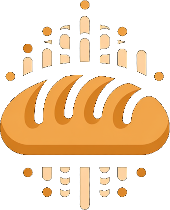

<div align="center">
  

# Sourdaw

**A full digital audio workstation that runs wherever Chromium does.**

[Website](https://www.sourdaw.studio/) · [Contributing](./CONTRIBUTING.md) · [Security](./SECURITY.md) · [Privacy](./PRIVACY.md)
</div>

Sourdaw is open-source software that works in the browser and in an Electron
desktop shell. Same DAW, different door. It is active alpha software, not a
finished commercial release. There are no published releases yet; `main` is the
current source.

Sourdaw-owned source is licensed under [Apache-2.0](./LICENSE). Dependencies,
samples, model weights, and other third-party material retain their own terms;
see the [third-party notices](./public/legal/THIRD-PARTY-NOTICES.md).

## What works here

- **Browser:** React/Vite, Web Audio, WASM DSP, local project persistence, and
  selected local AI features.
- **Desktop:** Electron with the Rust native addon. The current local packaging
  target is macOS arm64.
- **Collaboration:** direct WebRTC sessions, an optional authenticated WebSocket
  relay, and native LAN discovery. These are collaboration transports, not a
  hosted Sourdaw service.
- **Plugins:** CLAP scanning and hosting on desktop. VST® 3 is unsupported.

## Run it

### Prerequisites

- Node.js `>=24.15.0 <25`
- pnpm `11.6.0`
- Rust nightly `nightly-2026-04-14` for desktop and native work

### Browser app

```sh
pnpm install
pnpm dev
```

Build it with `pnpm build`.

The optional collaboration relay has its own dependencies:

```sh
npm --prefix server ci --include=dev
```

### Desktop app

```sh
pnpm install
pnpm desktop:build
```

This creates a local macOS arm64 package. It is ad-hoc signed, not distribution
signed, notarized, published, or updated automatically.

## Read next

- [Developer documentation](./docs/README.md)
- [Release proof](./docs/release.md)
- [User manual](./docs/manual/README.md)
