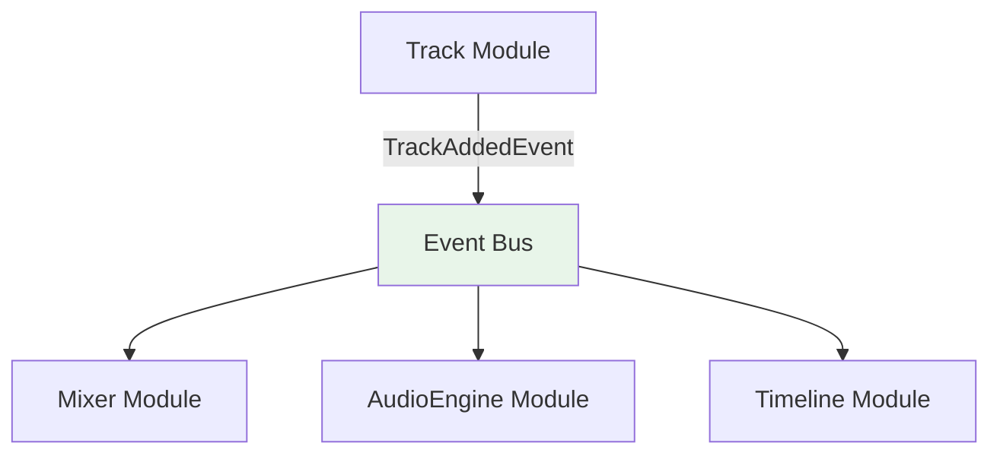

# Events

Cross-module communication via domain events enables loose coupling. This guide explains how to define, publish, and subscribe to events. The event infrastructure lives in `src/infra/events/` and is built around `createEventBus<TEventMap>()` — a fully typed, functional event bus. Event payloads often inform cache invalidations or UI updates in [state management](./03-state-management.md).

## Core workflow

The process of using events follows three main steps:

1. **[Define an Event](#1-define-the-event)**: Define a typed payload in the app's `EventMap`.
2. **[Publish an Event](#2-publish-the-event)**: Emit the event from a use case after a business operation completes.
3. **[Subscribe to an Event](#3-subscribe-to-the-event)**: Listen for the event in other modules to trigger side effects, such as cache updates or analytics tracking.

---

## Inter-module communication

Domain events enable modules to communicate without direct dependencies:



**Benefits:**

- **Loose coupling**: Modules remain independent and testable
- **Framework agnostic**: Events work across different layers and technologies
- **Type safety**: Strong typing prevents communication errors
- **Asynchronous**: Non-blocking communication preserves performance
- **Extensibility**: New modules can subscribe without modifying existing code

## Event implementation

### 1. Define the event

Events are plain typed payloads defined in the app's `AppEvents` map. Each event is a string key mapped to a payload type.

#### Event map and payload definition

All event payloads are defined as plain types in module `events/` folders, then assembled into the central `AppEvents` map:

```typescript
// Arrangement/events/TrackAddedEvent.ts
export type TrackAddedPayload = { trackId: string; name: string; kind: string };

// Arrangement/events/TrackRemovedEvent.ts
export type TrackRemovedPayload = { trackId: string };

// app/registerDependencies.ts
import { createEventBus } from '#/infra/events/createEventBus';
import { type TrackAddedPayload } from '#/modules/Arrangement/events/TrackAddedEvent';
import { type TrackRemovedPayload } from '#/modules/Arrangement/events/TrackRemovedEvent';

export type AppEvents = {
    'track.added': TrackAddedPayload;
    'track.removed': TrackRemovedPayload;
};

export const eventBus = createEventBus<AppEvents>();
```

#### Event naming conventions

Use `noun.pastTense` dot-separated string keys for clarity:

```typescript
// ✅ Clear, descriptive names
'transport.started';
'plugin.loaded';
'track.muted';

// ❌ Vague or unclear names
'transport';
'update';
'data.changed';
```

### 2. Publish the event

Publish events from business operations, typically at the end of a use case after the primary action has succeeded.

#### Publishing from use cases

```typescript
// Arrangement/useCases/addTrack.ts

import { eventBus } from '#/app/bootstrap';

export function addTrack(input: AddTrackInput): Track | null {
    const state = getTrackState();
    if (!state) return null;

    const track = createTrack(input);
    setTrackState({ ...state, tracks: [...state.tracks, track], selectedTrackId: track.id });

    eventBus.emit('track.added', { trackId: track.id, name: track.name, kind: track.kind });
    return track;
}
```

> [!IMPORTANT]
> `eventBus.emit()` returns `Promise<void>`. Prefix with `void` to satisfy `@typescript-eslint/no-floating-promises`.

When publishing events, ensure the payload contains sufficient, immutable context so that subscribers can act on the event without needing to make additional API calls to fetch related data.

### 3. Subscribe to the event

Subscribe to events in other domains to trigger side effects, such as updating a cache, sending analytics, or starting a new workflow. Handlers should be kept small and delegate any long-running or complex work to use cases.

#### Cross-module event handling

Subscribe to events from other domains. The `on()` method returns an unsubscribe function:

```typescript
// Mixer/useCases/trackEventHandlers.ts

import { eventBus } from '#/app/bootstrap';

export function initMixerSubscribers(): () => void {
    const unsubscribe = eventBus.on('track.added', (payload) => {
        // payload is typed as TrackAddedPayload — no .payload wrapper
        const store = getMixerTracksStore();
        store.update((current) => [...(current ?? []), payload]);
    });

    return unsubscribe;
}
```

#### Creating reusable subscription helpers

For events that are frequently subscribed to, you can create a reusable helper function:

```ts
// Common/Flags/useCases/subscribeToFlagsFetchedEvent.ts
import { eventBus } from '#/app/bootstrap';

type Callback = (flags: FlagsFetchedPayload) => void;

export function subscribeToFlagsFetchedEvent(callback: Callback): () => void {
    return eventBus.on('flags.fetched', (payload) => {
        callback(payload);
    });
}
```

> [!WARNING]
> Do not resolve Container dependencies at module scope in hook files — resolve them inside `useEffect` instead. Module-scope resolution in a hook file can evaluate before bootstrap has registered dependencies. See [dependency injection](./01-dependency-injection.md) for the full rule.

The following example illustrates the anti-pattern and its fix. Note the use of `useEffectEvent` (stable in React 19.2) to capture the latest callback without adding it to the Effect's dependency array, preventing unnecessary re-subscriptions:

```typescript
// FeatureFlags/presentations/hooks/useFlagSubscription.ts

// ❌ Bad: eventBus at module scope in a hook file
import { eventBus } from '#/app/bootstrap';

export const useFlagSubscription = (callback: () => void) => {
    useEffect(() => {
        return eventBus.on('flags.fetched', callback);
    }, [callback]);
};

// ✅ Good: useEffectEvent + resolve inside useEffect
import { useEffect, useEffectEvent } from 'react';
import { Container } from '#/infra/di/Container';
import { EventBus } from '#/infra/events/types';

export const useFlagSubscription = (callback: () => void) => {
    const onFlagsFetched = useEffectEvent(callback);

    useEffect(() => {
        const eventBus = Container.getInstance().get(EventBus);
        const unsubscribe = eventBus.on('flags.fetched', () => {
            onFlagsFetched();
        });

        return () => {
            unsubscribe();
        };
    }, []);
};
```

`useEffectEvent` always sees the latest `callback` value without causing the Effect to re-run. This eliminates stale closure bugs and avoids unnecessary teardown/setup cycles when the callback reference changes.

#### Event handler organization

Structure event handlers for maintainability. Each registration function returns an unsubscribe callback:

```typescript
// AiRuntime/useCases/registerAiEventHandlers.ts

import { eventBus } from '#/app/bootstrap';

export function registerAiEventHandlers(): () => void {
    const unsubs = [
        eventBus.on('track.added', syncAiTrackContext),
        eventBus.on('track.removed', removeAiTrackContext),
        eventBus.on('transport.started', handleTransportPlay),
        eventBus.on('transport.stopped', handleTransportStop),
        eventBus.on('plugin.loaded', analyzeNewPluginParameters),
    ];

    return () => unsubs.forEach((unsub) => unsub());
}
```

## Testing event flows

For a complete guide on our testing philosophy and patterns, see the [testing](./06-testing.md) documentation. The following examples show patterns specific to event-driven architectures.

The infra provides test helpers in `#/infra/events/testing/`:

- `recordEvents(bus)` — records all events emitted on the bus; access `.entries` to inspect

### Event handler testing

Test event handlers in isolation using `createEventBus()`:

```typescript
// Mixer/useCases/__tests__/trackEventHandlers.spec.ts
import { createEventBus } from '#/infra/events/createEventBus';

describe('initMixerSubscribers', () => {
    it('should update the mixer store when track.added fires', async () => {
        const bus = createEventBus<AppEvents>();
        // wire up the subscriber against the test bus
        initMixerSubscribers(bus);

        await bus.emit('track.added', { trackId: 'track-456', name: 'Bass', kind: 'audio' });

        expect(getMixerTracksStore().value).toContainEqual(expect.objectContaining({ trackId: 'track-456' }));
    });
});
```

### Event publishing testing

Test event publishing from use cases using `recordEvents`:

```typescript
// Track/useCases/__tests__/addTrack.spec.ts
import { createEventBus } from '#/infra/events/createEventBus';
import { recordEvents } from '#/infra/events/testing/recordEvents';

describe('addTrack', () => {
    it('should emit track.added after successful creation', async () => {
        const bus = createEventBus<AppEvents>();
        const recorder = recordEvents(bus);

        addTrack({ name: 'Vocals', kind: 'audio' });

        expect(recorder.entries).toContainEqual(
            expect.objectContaining({ event: 'track.added', payload: expect.objectContaining({ name: 'Vocals' }) })
        );
        recorder.stop();
    });
});
```

### Event payload guidelines

Include sufficient context for event handlers:

```typescript
// ✅ Event provides rich context, enabling subscribers to act without needing to perform additional lookups.
export type ProjectSettingsChangedPayload = {
    readonly projectId: string;
    readonly previousBpm: number;
    readonly newBpm: number;
    readonly sampleRate: number;
    readonly changedBy: string;
};

// ❌ Minimal context requires additional lookups
export type ProjectSettingsChangedPayload = {
    readonly projectId: string;
    readonly newBpm: number;
};
```
