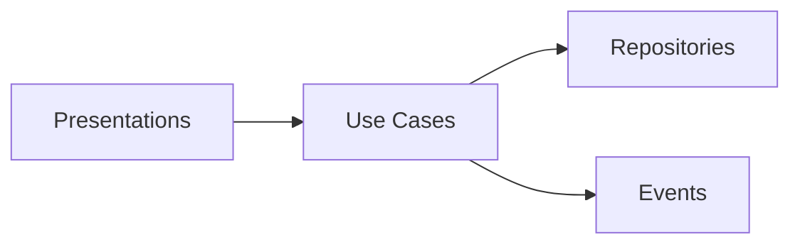
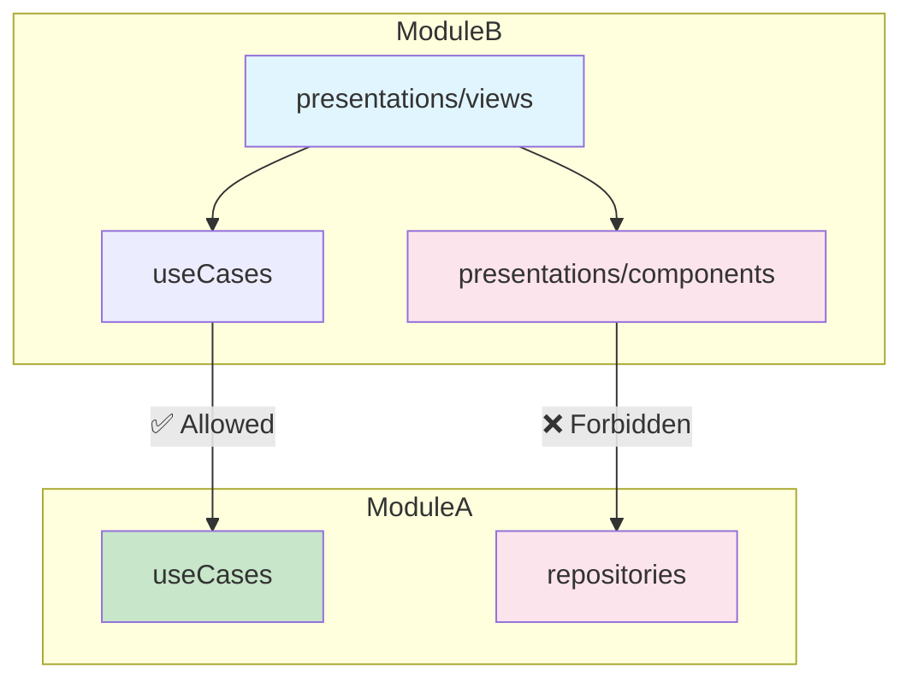
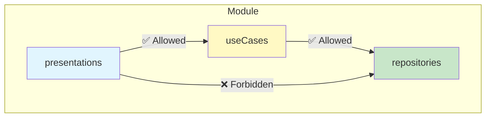
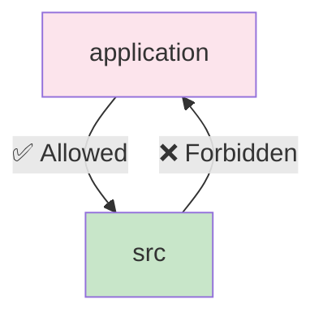
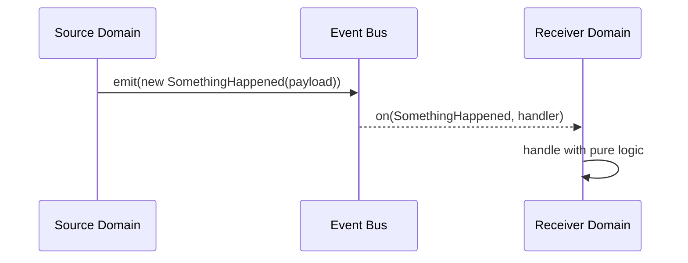

# Architecture

This guide defines the domain architecture and patterns. The goal is a minimal UI layer and a framework-agnostic core written in TypeScript, easily testable and easy to reason about, make changes and with clear boundaries.

## Contents

- [Core principles](#core-principles)
- [Module structure](#module-structure)
- [Layer implementation](#layer-implementation)
- [Dependency rules](#dependency-rules)
- [Testing approach](#testing-approach)
- [Implementation guidelines](#implementation-guidelines)
- [Quick reference](#quick-reference)

## Core principles

### Separation of concerns

Business logic is independent from UI frameworks. Use cases perform operations; presentations handle user interaction and rendering.



### Dependency direction

Dependencies flow from UI to business to IO:

```text
UI Layer → Business Layer → Data Layer
```

This prevents circular dependencies and enables isolated unit testing. These constraints are enforced by [boundaries](./boundaries.md).

### Contract-based communication

Domains expose minimal public interfaces through contract folders:

- **Use Cases**: Business operation interfaces
- **Events**: Cross-domain message contracts
- **Errors**: Domain error types for cross-module error handling
- **Views**: UI composition interfaces

### Framework independence

Business logic has no framework dependencies. To achieve this, we minimize the role of third party libraries and prefer pure TypeScript for use cases and transformers. The [React Compiler](https://react.dev/learn/react-compiler) handles memoization automatically, so the presentation layer stays thin -- no manual `useMemo`, `useCallback`, or `React.memo`. This enables:

- Framework migrations without business logic changes
- Comprehensive unit testing of business operations
- Reusable logic across different presentation layers. Forms, fetching, and UI composition are described in [forms](./forms.md), [data fetching](./data-fetching.md), and [routing](./routing.md).

## Module structure

Each domain follows a standardized folder structure with clear public contracts:

```text
Brand/                         # Domain name
├── _tests/                    # Test utilities and mocks
├── models/                    # Domain types
├── errors/                    # 🔗 CONTRACT: Domain error types
├── events/                    # 🔗 CONTRACT: Inter-domain events
├── useCases/                  # 🔗 CONTRACT: Business operations
├── repositories/              # Data access implementation
├── transformers/              # Data mapping functions
├── helpers/                   # Domain utilities
└── presentations/             # UI layer
    ├── components/            # Pure components, no business logic
    ├── hooks/                 # React integration
    ├── stores/                # UI state management
    ├── helpers/               # View utilities
    └── views/                 # 🔗 CONTRACT: Consumes use cases through hooks
```

Contract folders can be imported by other domains. All other folders remain domain-private.

## Layer implementation

### Models

Define core domain entities. This model should be a subset of the properties needed by the domain, based on the canonical types you provided.

```typescript
// Brand/models/Brand.ts

export type Brand = {
    id: number;
    name: string;
    slug: string;
    color: string | null;
};
```

Should not host any and all manner of types. Find contextual locations for auxiliary and presentation types (ie: `/types`, `types.ts`, next to the function declaration that consumes it, etc).

### Repositories

Handle IO and external service integration. Always return domain models.

```typescript
// Brand/repositories/getBrandByIdApi.ts

type GetBrandResponse = {
    id: number;
    name: string;
    brand_color: string;
};

type GetBrandByIdApiOutput = Promise<Brand | null>;

export const getBrandByIdApi = inject({ httpClient: HttpClient }, ({ httpClient }) => {
    return function (id: number, signal: AbortSignal): GetBrandByIdApiOutput {
        const { result } = await httpClient.get<GetBrandResponse>(`api/brand/${id}`, { signal });

        if (!result.data) {
            return null;
        }

        return {
            id: result.data.id,
            name: result.data.name,
            color: result.data.brand_color,
        };
    };
});
```

### Transformers

Convert external or persistence-layer shapes into domain models. Keep pure and deterministic. Place non-trivial mappings here to keep repositories focused on IO and use cases expressive. For simpler transformations, inlining is acceptable.

```typescript
// Brand/transformers/transformBrand.ts

type TransformBrandInput = {
    id: number;
    name: string;
    brand_color: string;
};

export const transformBrand = (brand: TransformBrandInput): Brand => {
    return {
        id: brand.id,
        name: brand.name,
        color: brand.brand_color,
    };
};
```

### Use cases

Implement business operations with clear interfaces:

```typescript
// Brand/useCases/getBrandById.ts

type GetBrandByIdOutput = Promise<Brand | null>;

export const getBrandById = inject({ getBrandByIdApi }, ({ getBrandByIdApi }) => {
    return async function (id: number, signal: AbortSignal): GetBrandByIdOutput {
        const data = await getBrandByIdApi(id, signal);

        if (!data) {
            return null;
        }

        return data;
    };
});
```

When a use case is consumed by another module, its output type becomes a cross-module contract. In that case, the use case must export an explicit DTO type rather than returning an internal model. This keeps the module's models private and gives consumers a stable type to import from `useCases/` (a contract folder). Within the same module, returning models directly is accepted.

#### Cross-module DTO example

Module A's use case exports a DTO - a subset of its internal model:

```typescript
// Brand/useCases/getBrand.ts

export type BrandDto = { id: number; name: string; isPublished: boolean };
export type GetBrandUsecase = (input: GetBrandInput) => Promise<BrandDto>;
export const getBrand: GetBrandUsecase ...
```

Module B's transformer imports the DTO across the boundary and maps it to a local type:

```typescript
// Guideline/transformers/transformBrandToGuidelineSummary.ts

import { type BrandDto } from '#/modules/Brand/useCases/getBrand';

type GuidelineBrandSummary = { brandId: number; isPublished: boolean };

export const transformBrandToGuidelineSummary = (brand: BrandDto): GuidelineBrandSummary => ({
    brandId: brand.id,
    isPublished: brand.isPublished,
});
```

Module B's use case calls the cross-module use case and consumes the transformed result:

```typescript
// Guideline/useCases/getGuidelineSummary.ts

import { getBrand } from '#/modules/Brand/useCases/getBrand';
import { transformBrandToGuidelineSummary } from '#/modules/Guideline/transformers/transformBrandToGuidelineSummary';

// inside the use case:
const brand = await getBrand({ id: guideline.brandId });
const brandSummary = transformBrandToGuidelineSummary(brand);

if (!brandSummary.isPublished) {
    return;
}

...
```

- `Brand/models/Brand.ts` is **never imported** by Module B - the DTO is the only cross-module type contract.
- The transformer stays pure - it consumes a DTO and produces a module-local type.
- The use case consumes the transformed result in its own business logic rather than passing it through.

### Errors

Define typed error classes that repositories throw and other modules catch. Place error classes in an `errors/` folder, this makes them part of the module's public contract so consumers can import and `instanceof`-check them without coupling to internal repositories.

```typescript
// Brand/errors/BrandNotFoundError.ts

export class BrandNotFoundError extends Error {
    readonly name = 'BrandNotFoundError';

    constructor(readonly brandId: number) {
        super(`Brand ${brandId} not found`);
    }
}
```

Example: Repositories throw domain errors; use cases and presentations catch them by importing from the `errors/` contract folder:

```typescript
// Guideline/useCases/getGuidelineSummary.ts

import { BrandNotFoundError } from '#/modules/Brand/errors/BrandNotFoundError';

try {
    const brand = await getBrand({ id: guideline.brandId });
} catch (error) {
    if (error instanceof BrandNotFoundError) {
        // handle known cross-module error
    }
    throw error;
}
```

### Events

Enable cross-domain communication. For a detailed guide, see the [events](./events.md) documentation.

```typescript
// Brand/events/BrandCreatedEvent.ts

export class BrandCreatedEvent extends DomainEvent<{
    readonly brandId: number;
    readonly createdBy: number;
    readonly createdAt: Date;
}> {}
```

### Presentations

Implement UI components and React integration. For server state, we use [TanStack Query](./data-fetching.md) and never fetch data directly in `useEffect`. The React Compiler handles memoization, so hooks and components are written without manual `useMemo`/`useCallback`.

```typescript
// Brand/presentations/hooks/useBrand.ts

export const useBrand = (id: number) => {
    const { data: brand } = useSuspenseQuery({
        queryKey: ['brand', id],
        queryFn: () => getBrandById(id),
    });

    return { brand };
};

useBrand.getKey = (id: number) => ['brand', id];
```

## Dependency rules

### Cross-module dependencies

Modules can only import from contract folders of other modules:

```typescript
// ✅ Allowed
import { getBrandById } from '#/modules/Brand/useCases/getBrandById';

// ❌ Forbidden (importing from a non-contract folder)
import { type Brand } from '#/modules/Brand/models/Brand';
import { getBrandByIdApi } from '#/modules/Brand/repositories/getBrandByIdApi';
```

### Intra-module dependencies

Within a module, dependencies follow layer boundaries:

```text
presentations → useCases → repositories
presentations → models
useCases → models
repositories → models
```

### Application layer integration

The `application/` layer can import from `src/modules/` contract folders but not vice versa:

```typescript
// application/ code can import from src/modules/
import { getBrandById } from '#/modules/Brand/useCases/getBrandById';

// src/modules/ cannot import from application/
// This prevents business logic from depending on legacy code
```

## Testing approach

A key benefit of this architecture is its inherent testability. The strict separation of concerns allows each layer to be tested in isolation:

- **Use Cases**: As pure TypeScript functions, they can be unit-tested without any UI framework, ensuring the core business logic is robust.
- **Repositories**: These can be tested by mocking their external dependencies (e.g., GraphQL executors or HTTP clients) to verify data transformation logic.
- **Presentations**: UI components can be tested independently by providing mock data, without needing to run the underlying business logic.

This approach simplifies test setup and leads to faster, more reliable tests. For a comprehensive guide with detailed examples for each layer, see the [testing](./testing.md) documentation.

## Implementation guidelines

### Domain boundaries

Create domains based on business capabilities. It's better to favor smaller, more focused domains over large, monolithic ones.

- **Authorization**: Handles permissions, roles, and access control policies.
- **Brand**: Brand information and asset management
- **User**: User and permission management
- **Analytics**: Usage tracking and reporting
- **Tracking**: Event logging and audit trails
- **File**: Handles file uploading.

This granularity makes each domain easier to understand, test, and maintain.

#### Cross-module boundaries

Modules can only import from the public contract folders of other modules. Any attempt to import from an internal folder (like `repositories` or `components`) is forbidden.



- Only the following folders are considered contract surfaces and may be imported by other modules:
    - `errors/`
    - `events/`
    - `useCases/`
    - `presentations/views/`
- ❌ Any imports across modules to other folders (e.g., `models/`, `repositories/`, `transformers/`, `presentations/components/`, `presentations/stores/`, `helpers/`) are forbidden. Each module owns its own types; integration happens through use cases, events, and errors, with transformers mapping at the boundaries.

#### Intra-module boundaries

Within a single module, dependencies must flow from the presentation layer down to the data layer. Direct jumps (e.g., a component importing a repository) are not allowed.



- ✅ Only `presentations/*` may import from `presentations/stores/` within the same module.
- ✅ Only `useCases` and `repositories` may import from `repositories/` within the same module.
- ❌ `presentations/*` cannot import from `repositories/` directly.
- ❌ Transformers must remain pure and may not import from `repositories`, `useCases`, or `presentations/stores`.

##### Practical examples

```typescript
// ✅ Allowed: cross-module import from contract folders
import { updateUserPermissions } from '#/modules/User/useCases/updateUserPermissions';

// ❌ Forbidden: cross-module import from non-contract folders
import { type Brand } from '#/modules/Brand/models/Brand';
import { getBrandByIdApi } from '#/modules/Brand/repositories/getBrandByIdApi';

// ✅ Allowed: presentations/view consuming use cases
import { getBrandById } from '#/modules/Brand/useCases/getBrandById';

// ❌ Forbidden: components accessing stores directly
import { getBrandStore } from '#/modules/Brand/presentations/stores/brandStore';
```

#### Application vs src

The legacy `application` directory can consume code from the modern `src` modules, but not the other way around. This prevents new, clean code from becoming dependent on legacy implementations.



- ❌ `src` cannot import from `application`.
- ✅ `application` may import only from `src/helpers` and the contract folders listed above (`errors/`, `events/`, `useCases/`, `presentations/views/`).

#### Testing boundaries

- ❌ Do not import from `*.spec.*` or `*.test.*` files.

### Contract design

Keep public interfaces minimal and stable:

```typescript
// ✅ Stable interface
export const searchBrands = (query: BrandSearchQuery): Promise<Brand[]> => {
    return Promise<Brand[]>;
};

// ❌ Leaking implementation details
export const searchBrands = (esQuery: ElasticsearchQuery): Promise<ESResponse> => {
    return Promise<ESResponse>;
};
```

### Event patterns

Use events for cross-domain coordination:



```typescript
// When user publishes a brand
eventBus.emit(new BrandCreatedEvent({ brandId, userId }));

// Analytics domain can react without direct coupling
eventBus.on(BrandCreatedEvent, trackBrandCreation);
```

## Quick reference

### Contract folders

These folders define public APIs that other domains can import:

| Folder                 | Purpose             | Import Pattern                                                               |
| ---------------------- | ------------------- | ---------------------------------------------------------------------------- |
| `errors/`              | Domain error types  | `import { BrandError } from '#/modules/Domain/errors/BrandError'`            |
| `useCases/`            | Business operations | `import { getBrand } from '#/modules/Domain/useCases/getBrand'`              |
| `events/`              | Event definitions   | `import { BrandEvent } from '#/modules/Domain/events/BrandEvent'`            |
| `presentations/views/` | UI compositions     | `import { BrandView } from '#/modules/Domain/presentations/views/BrandView'` |

### Internal folders

These folders are implementation details and should not be imported by other domains:

- `models/` - Domain types (each module owns its own types)
- `repositories/` - Data access implementation
- `transformers/` - Data mapping functions
- `helpers/` - Domain utilities
- `presentations/components/` - Internal UI components
- `presentations/hooks/` - Internal React hooks
- `presentations/stores/` - Internal state management
