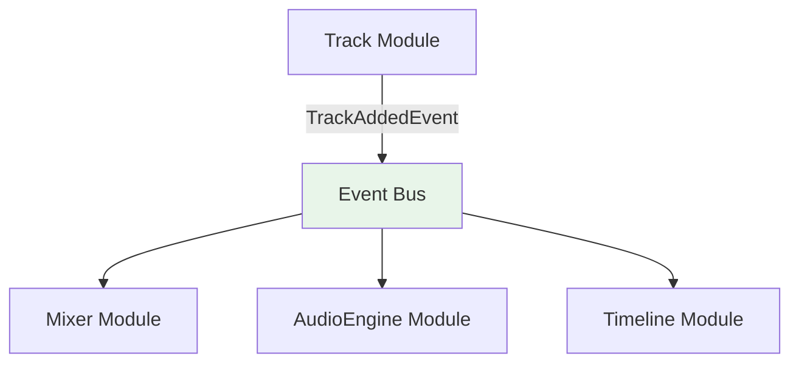

# Events

Cross-module communication via domain events enables loose coupling. This guide explains how to define, publish, and subscribe to events. The base classes and APIs documented here match `src/helpers/Event/DomainEvent.ts` and `src/helpers/Event/EventBus.ts`. Event payloads often inform cache invalidations or UI updates in TanStack Query and [state management](./state-management.md).

## Core workflow

The process of using events follows three main steps:

1. **[Define an Event](#1-define-the-event)**: Create a strongly-typed event class that represents a specific domain occurrence.
2. **[Publish an Event](#2-publish-the-event)**: Emit the event from a use case after a business operation completes.
3. **[Subscribe to an Event](#3-subscribe-to-the-event)**: Listen for the event in other modules to trigger side effects, such as cache updates or analytics tracking.

---

## Inter-module communication

Domain events enable modules to communicate without direct dependencies:



**Benefits:**

- **Loose coupling**: Modules remain independent and testable
- **Framework agnostic**: Events work across different layers and technologies
- **Type safety**: Strong typing prevents communication errors
- **Asynchronous**: Non-blocking communication preserves performance
- **Extensibility**: New modules can subscribe without modifying existing code

## Event implementation

### 1. Define the event

Define domain events with a clear type structure and follow consistent naming conventions.

#### Event definition

Define domain events with clear type structure:

```typescript
// src/helpers/Event/DomainEvent.ts
export abstract class DomainEvent<TPayload = unknown> {
    // readonly payload: TPayload
    // readonly timestamp: number (milliseconds)
}

// Track/events/TrackAddedEvent.ts
export class TrackAddedEvent extends DomainEvent<{ trackId: string; name: string; kind: 'audio' | 'midi' }> {
    constructor(payload: TrackAddedEvent['payload']) {
        super(payload);
    }
}
```

#### Event naming conventions

Follow consistent naming patterns for clarity, using verbs in their past tense form at the end of each event name:

```typescript
// ✅ Clear, descriptive names
export class TransportStartedEvent extends DomainEvent<TransportStartedPayload> {}
export class PluginLoadedEvent extends DomainEvent<PluginLoadedPayload> {}
export class TrackMutedEvent extends DomainEvent<TrackMutedPayload> {}

// ❌ Vague or unclear names
export class TransportEvent extends DomainEvent<TransportPayload> {}
export class UpdateEvent extends DomainEvent<UpdatePayload> {}
export class DataChangedEvent extends DomainEvent<DataPayload> {}
```

### 2. Publish the event

Publish events from business operations, typically at the end of a use case after the primary action has succeeded.

#### Publishing from use cases

Publish events from business operations:

```typescript
// Track/useCases/addTrack.ts

type AddTrackOutput = Promise<Track>;

export const addTrack = inject({ createTrackApi, eventBus: EventBus }, ({ createTrackApi, eventBus }) => {
    return async function ({ projectId, name, kind }: AddTrackInput): AddTrackOutput {
        const track = await createTrackApi({ projectId, name, kind });

        // Publish domain event
        eventBus.emit(
            new TrackAddedEvent({
                trackId: track.id,
                name: track.name,
                kind: track.kind,
            })
        );

        return track;
    };
});
```

When publishing events, ensure the payload contains sufficient, immutable context so that subscribers can act on the event without needing to make additional API calls to fetch related data.

### 3. Subscribe to the event

Subscribe to events in other domains to trigger side effects, such as updating a cache, sending analytics, or starting a new workflow. Handlers should be kept small and delegate any long-running or complex work to use cases.

#### Cross-module event handling

Subscribe to events from other domains:

```typescript
// Mixer/useCases/trackEventHandlers.ts

type HandleTrackAddedOutput = Promise<void>;

export const handleTrackAdded = inject({ queryClient: QueryClient }, ({ queryClient }) => {
    return async function (event: TrackAddedEvent): HandleTrackAddedOutput {
        // Invalidate the mixer tracks cache so the new track fader appears
        await queryClient.invalidateQueries({
            queryKey: ['mixer-tracks', event.payload.projectId],
        });
    };
});

// Register event handlers
eventBus.on(TrackAddedEvent, handleTrackAdded);
```

#### Creating reusable subscription helpers

For events that are frequently subscribed to, you can create a reusable helper function using `inject`. This encapsulates the subscription logic and makes it easy to use in different parts of the application, especially in React hooks.

```ts
// Common/Flags/useCases/subscribeToFlagsFetchedEvent.ts
import { inject } from '#/helpers/DependencyInjector/inject';
import { EventBus } from '#/helpers/Event/EventBus';
import { FlagsFetchedEvent } from '../events/FlagsFetchedEvent';

type SubscribeToFlagsFetchedEventCallback = (flags: FlagsFetchedEvent['payload']) => void;
type Unsubscribe = () => void;

export const subscribeToFlagsFetchedEvent = inject({ eventBus: EventBus }, ({ eventBus }) => {
    return function (callback: SubscribeToFlagsFetchedEventCallback): Unsubscribe {
        return eventBus.on(FlagsFetchedEvent, (event) => {
            callback(event.payload);
        });
    };
});
```

> [!WARNING]
> Using `inject` in hooks is forbidden as it does not work correctly after the minification process. Use `Container.getInstance()` to resolve dependencies instead.

The following example illustrates the anti-pattern and its fix. Note the use of `useEffectEvent` (stable in React 19.2) to capture the latest callback without adding it to the Effect's dependency array, preventing unnecessary re-subscriptions:

```typescript
// FeatureFlags/presentations/hooks/useFlagSubscription.ts

// ❌ Bad: inject will fail after minification
export const useFlagSubscription = (callback: () => void) => {
    useEffect(() => {
        const subscribe = inject({ eventBus: EventBus }, ({ eventBus }) => {
            return eventBus.on(FlagsFetchedEvent, callback);
        });

        return subscribe();
    }, [callback]);
};

// ✅ Good: useEffectEvent + Container.getInstance()
import { useEffect, useEffectEvent } from 'react';

export const useFlagSubscription = (callback: () => void) => {
    const onFlagsFetched = useEffectEvent(callback);

    useEffect(() => {
        const eventBus = Container.getInstance().get(EventBus);
        const unsubscribe = eventBus.on(FlagsFetchedEvent, () => {
            onFlagsFetched();
        });

        return () => {
            unsubscribe();
        };
    }, []);
};
```

`useEffectEvent` always sees the latest `callback` value without causing the Effect to re-run. This eliminates stale closure bugs and avoids unnecessary teardown/setup cycles when the callback reference changes.

#### Event handler organization

Structure event handlers for maintainability:

```typescript
// AiRuntime/useCases/registerAiEventHandlers.ts

export function registerAiEventHandlers(eventBus: EventBus): () => void {
    // Track activity events
    eventBus.on(TrackAddedEvent, syncAiTrackContext);
    eventBus.on(TrackRemovedEvent, removeAiTrackContext);

    // Transport interaction events
    eventBus.on(TransportStartedEvent, handleTransportPlay);
    eventBus.on(TransportStoppedEvent, handleTransportStop);

    // Audio engine events
    eventBus.on(PluginLoadedEvent, analyzeNewPluginParameters);

    return () => {
        eventBus.off(TrackAddedEvent, syncAiTrackContext);
        eventBus.off(TrackRemovedEvent, removeAiTrackContext);
        eventBus.off(TransportStartedEvent, handleTransportPlay);
        eventBus.off(TransportStoppedEvent, handleTransportStop);
        eventBus.off(PluginLoadedEvent, analyzeNewPluginParameters);
    };
}
```

## Testing event flows

For a complete guide on our testing philosophy and patterns, see the [testing](./testing.md) documentation. The following examples show patterns specific to event-driven architectures.

### Event handler testing

Test event handlers in isolation:

```typescript
// Mixer/useCases/trackEventHandlers.spec.ts

vi.mock('@tanstack/react-query');

describe('handleTrackAdded', () => {
    it('invalidates mixer tracks query when a track is added', async () => {
        // Arrange
        const queryClientMock = { invalidateQueries: vi.fn() };

        const event = new TrackAddedEvent({
            projectId: 'proj-123',
            trackId: 'track-456',
            name: 'Bass',
            kind: 'audio',
        });

        // Act
        await handleTrackAdded(event);

        // Assert
        expect(queryClientMock.invalidateQueries).toHaveBeenCalledTimes(1);
        expect(queryClientMock.invalidateQueries).toHaveBeenCalledWith({
            queryKey: ['mixer-tracks', 'proj-123'],
        });
    });
});
```

### Event publishing testing

Test event publishing from use cases:

```typescript
// Track/useCases/addTrack.spec.ts

describe('addTrack', () => {
    beforeEach(() => {
        vi.resetAllMocks();
    });

    it('publishes TrackAddedEvent after successful creation', async () => {
        const track = TrackDummy.create({ id: 'track-123', name: 'Vocals', kind: 'audio' });
        vi.mocked(createTrackApi).mockResolvedValue(track);

        await addTrack({
            projectId: 'proj-123',
            name: 'Vocals',
            kind: 'audio',
        });

        expect(eventBus.emit).toHaveBeenCalledWith(expect.any(TrackAddedEvent));
    });
});
```

### Event payload guidelines

Include sufficient context for event handlers:

```typescript
// Project/events/ProjectSettingsChangedEvent.ts

// ✅ Event provides rich context, enabling subscribers to act without needing to perform additional lookups.
export class ProjectSettingsChangedEvent extends DomainEvent<{
    readonly projectId: string;
    readonly previousBpm: number;
    readonly newBpm: number;
    readonly sampleRate: number;
    readonly changedBy: string;
}> {}

// ❌ Minimal context requires additional lookups
export class ProjectSettingsChangedEvent extends DomainEvent<{
    readonly projectId: string;
    readonly newBpm: number;
}> {}
```
