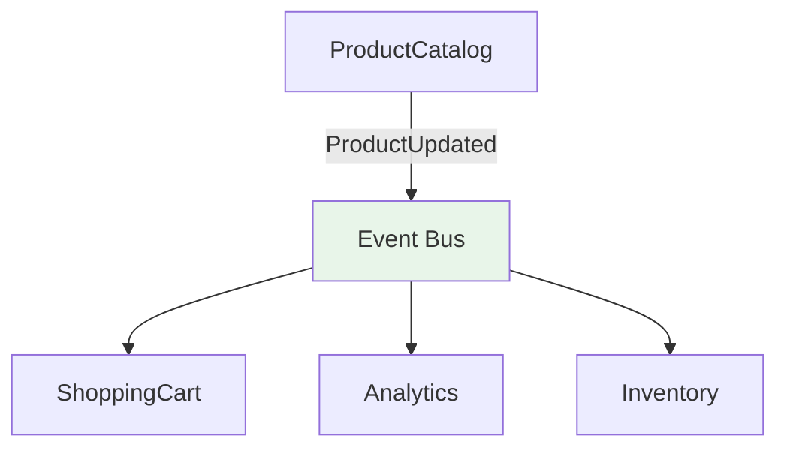

# Events

Cross-module communication via domain events enables loose coupling. This guide explains how to define, publish, and subscribe to events. The base classes and APIs documented here match `src/helpers/Event/DomainEvent.ts` and `src/helpers/Event/EventBus.ts`. Event payloads often inform cache invalidations or UI updates in [data fetching](./data-fetching.md) and [state management](./state-management.md).

## Core workflow

The process of using events follows three main steps:

1. **[Define an Event](#1-define-the-event)**: Create a strongly-typed event class that represents a specific domain occurrence.
2. **[Publish an Event](#2-publish-the-event)**: Emit the event from a use case after a business operation completes.
3. **[Subscribe to an Event](#3-subscribe-to-the-event)**: Listen for the event in other modules to trigger side effects, such as cache updates or analytics tracking.

---

## Inter-module communication

Domain events enable modules to communicate without direct dependencies:



**Benefits:**

- **Loose coupling**: Modules remain independent and testable
- **Framework agnostic**: Events work across different layers and technologies
- **Type safety**: Strong typing prevents communication errors
- **Asynchronous**: Non-blocking communication preserves performance
- **Extensibility**: New modules can subscribe without modifying existing code

## Event implementation

### 1. Define the event

Define domain events with a clear type structure and follow consistent naming conventions.

#### Event definition

Define domain events with clear type structure:

```typescript
// src/helpers/Event/DomainEvent.ts
export abstract class DomainEvent<TPayload = unknown> {
    // readonly payload: TPayload
    // readonly timestamp: number (milliseconds)
}

// ProductCatalog/events/ProductUpdatedEvent.ts
export class ProductUpdatedEvent extends DomainEvent<{ id: number; changes: Record<string, unknown> }> {
    constructor(payload: ProductUpdatedEvent['payload']) {
        super(payload);
    }
}
```

#### Event naming conventions

Follow consistent naming patterns for clarity, using verbs in their past tense form at the end of each event name:

```typescript
// Clear, descriptive names
export class OrderCompletedEvent extends DomainEvent<OrderCompletedPayload> {}
export class UserRegisteredEvent extends DomainEvent<UserRegisteredPayload> {}
export class PaymentProcessedEvent extends DomainEvent<PaymentProcessedPayload> {}

// ❌ Vague or unclear names
export class OrderEvent extends DomainEvent<OrderPayload> {}
export class UpdateEvent extends DomainEvent<UpdatePayload> {}
export class DataChangedEvent extends DomainEvent<DataPayload> {}
```

### 2. Publish the event

Publish events from business operations, typically at the end of a use case after the primary action has succeeded.

#### Publishing from use cases

Publish events from business operations:

```typescript
// ProductCatalog/useCases/updateProductPrice.ts

type UpdateProductPriceOutput = Promise<Product>;

export const updateProductPrice = inject({ patchProductApi, eventBus: EventBus }, ({ patchProductApi, eventBus }) => {
    return async function ({ id, newPrice, reason, updatedBy }: UpdateProductPriceInput): UpdateProductPriceOutput {
        const updatedProduct = await patchProductApi({ id, price: newPrice, reason, updatedBy });

        // Publish domain event
        eventBus.emit(
            new ProductPriceChangedEvent({
                productId: updatedProduct.id,
                previousPrice,
                newPrice,
                reason,
                effectiveDate: new Date(),
            })
        );

        return updatedProduct;
    };
});
```

When publishing events, ensure the payload contains sufficient, immutable context so that subscribers can act on the event without needing to make additional API calls to fetch related data.

### 3. Subscribe to the event

Subscribe to events in other domains to trigger side effects, such as updating a cache, sending analytics, or starting a new workflow. Handlers should be kept small and delegate any long-running or complex work to use cases.

#### Cross-module event handling

Subscribe to events from other domains:

```typescript
// ShoppingCart/useCases/productEventHandlers.ts

type HandlePriceChangedOutput = Promise<void>;

export const handlePriceChanged = inject({ findByProductId, updateProduct }, ({ findByProductId, updateProduct }) => {
    return async function (event: PriceChangedEvent): HandlePriceChangedOutput {
        const cartProducts = await findByProductId(event.payload.productId);

        // Update cart products with new price
        for (const cartProduct of cartProducts) {
            const updatedProduct = {
                ...cartProduct,
                unitPrice: event.payload.newPrice,
                lastUpdated: new Date(),
            };

            await updateProduct(updatedProduct);
        }
    };
});

// Register event handlers
eventBus.on(PriceChangedEvent, handlePriceChanged);
```

#### Creating reusable subscription helpers

For events that are frequently subscribed to, you can create a reusable helper function using `inject`. This encapsulates the subscription logic and makes it easy to use in different parts of the application, especially in React hooks.

```ts
// Common/Flags/useCases/subscribeToFlagsFetchedEvent.ts
import { inject } from '#/helpers/DependencyInjector/inject';
import { EventBus } from '#/helpers/Event/EventBus';
import { FlagsFetchedEvent } from '../events/FlagsFetchedEvent';

type SubscribeToFlagsFetchedEventCallback = (flags: FlagsFetchedEvent['payload']) => void;
type Unsubscribe = () => void;

export const subscribeToFlagsFetchedEvent = inject({ eventBus: EventBus }, ({ eventBus }) => {
    return function (callback: SubscribeToFlagsFetchedEventCallback): Unsubscribe {
        return eventBus.on(FlagsFetchedEvent, (event) => {
            callback(event.payload);
        });
    };
});
```

> [!WARNING]
> Using `inject` in hooks is forbidden as it does not work correctly after the minification process. Use `Container.getInstance()` to resolve dependencies instead.

The following example illustrates the anti-pattern and its fix. Note the use of `useEffectEvent` (stable in React 19.2) to capture the latest callback without adding it to the Effect's dependency array, preventing unnecessary re-subscriptions:

```typescript
// FeatureFlags/presentations/hooks/useFlagSubscription.ts

// ❌ Bad: inject will fail after minification
export const useFlagSubscription = (callback: () => void) => {
    useEffect(() => {
        const subscribe = inject({ eventBus: EventBus }, ({ eventBus }) => {
            return eventBus.on(FlagsFetchedEvent, callback);
        });

        return subscribe();
    }, [callback]);
};

// ✅ Good: useEffectEvent + Container.getInstance()
import { useEffect, useEffectEvent } from 'react';

export const useFlagSubscription = (callback: () => void) => {
    const onFlagsFetched = useEffectEvent(callback);

    useEffect(() => {
        const eventBus = Container.getInstance().get(EventBus);
        const unsubscribe = eventBus.on(FlagsFetchedEvent, () => {
            onFlagsFetched();
        });

        return () => {
            unsubscribe();
        };
    }, []);
};
```

`useEffectEvent` always sees the latest `callback` value without causing the Effect to re-run. This eliminates stale closure bugs and avoids unnecessary teardown/setup cycles when the callback reference changes.

#### Event handler organization

Structure event handlers for maintainability:

```typescript
// Analytics/useCases/registerAnalyticsEventHandlers.ts

export const registerAnalyticsEventHandlers = (eventBus: EventBus) => {
    // User activity events
    eventBus.on(UserRegisteredEvent, trackUserRegistration);
    eventBus.on(UserLoggedInEvent, trackUserLogin);

    // Product interaction events
    eventBus.on(ProductViewedEvent, trackProductView);
    eventBus.on(ProductAddedToCartEvent, trackCartAddition);

    // Purchase events
    eventBus.on(OrderCompletedEvent, trackPurchase);
    eventBus.on(PaymentProcessedEvent, trackPaymentMethod);

    return () => {
        eventBus.off(UserRegisteredEvent, trackUserRegistration);
        eventBus.off(UserLoggedInEvent, trackUserLogin);
        eventBus.off(ProductViewedEvent, trackProductView);
        eventBus.off(ProductAddedToCartEvent, trackCartAddition);
        eventBus.off(OrderCompletedEvent, trackPurchase);
        eventBus.off(PaymentProcessedEvent, trackPaymentMethod);
    };
};
```

## Testing event flows

For a complete guide on our testing philosophy and patterns, see the [testing](./testing.md) documentation. The following examples show patterns specific to event-driven architectures.

### Event handler testing

Test event handlers in isolation:

```typescript
// ShoppingCart/useCases/productEventHandlers.spec.ts

vi.mock('#/modules/ShoppingCart/repositories/shoppingCartApi');

describe('handleProductPriceChanged', () => {
    it('updates cart products when product price changes', async () => {
        // Arrange
        const productId = 'product-123';
        const cartProducts = [
            CartProductDummy.create({ cartId: 'c1', productId, unitPrice: 100 }),
            CartProductDummy.create({ cartId: 'c2', productId, unitPrice: 100 }),
        ];
        vi.mocked(findByProductId).mockResolvedValue(cartProducts);

        const event = new ProductPriceChangedEvent({
            productId,
            previousPrice: 100,
            newPrice: 120,
            reason: 'market_adjustment',
            effectiveDate: new Date(),
        });

        // Act
        await handleProductPriceChanged(event);

        // Assert
        expect(updateProduct).toHaveBeenCalledTimes(2);
        expect(updateProduct).toHaveBeenCalledWith(expect.objectContaining({ unitPrice: 120 }));
    });
});
```

### Event publishing testing

Test event publishing from use cases:

```typescript
// ProductCatalog/useCases/updateProductPrice.spec.ts

describe('updateProductPrice', () => {
    beforeEach(() => {
        vi.resetAllMocks();
    });

    it('publishes ProductPriceChangedEvent after successful update', async () => {
        const product = ProductDummy.create({ id: 'product-123', price: new Money(100, 'USD') });
        vi.mocked(getProductById).mockResolvedValue(product);
        vi.mocked(updateProduct).mockResolvedValue(undefined);

        await updateProductPrice({
            productId: 'product-123',
            newPrice: new Money(120, 'USD'),
            reason: 'market_adjustment',
            updatedBy: 'user-456',
        });

        expect(eventBus.emit).toHaveBeenCalledWith(expect.any(ProductPriceChangedEvent));
    });
});
```

### Event payload guidelines

Include sufficient context for event handlers:

```typescript
// Authorization/events/UserPermissionChangedEvent.ts

// ✅ Event provides rich context, enabling subscribers to act without needing to perform additional lookups.
export class UserPermissionChangedEvent extends DomainEvent<{
    readonly userId: UserId;
    readonly previousPermissions: Permission[];
    readonly newPermissions: Permission[];
    readonly changedBy: UserId;
    readonly reason: string;
    readonly effectiveDate: Date;
    readonly affectedResources: ResourceId[];
}> {}

// ❌ Minimal context requires additional lookups
export class UserPermissionChangedEvent extends DomainEvent<{
    readonly userId: UserId;
    readonly newPermissions: Permission[];
}> {}
```
